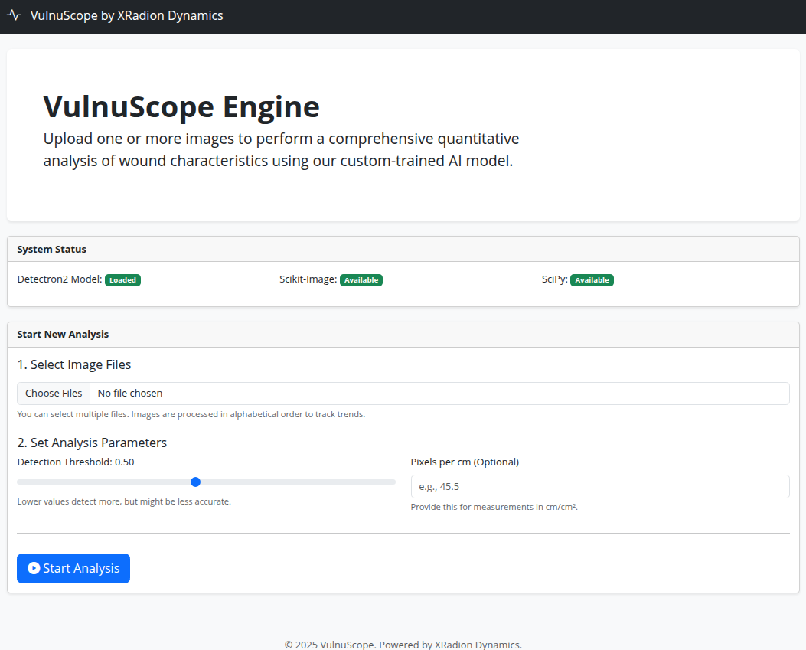

# ▰▰▰ [ VULNUSCOPE ] ▰▰▰
> **LIGHTWEIGHT AI WOUND ANALYSIS**

VulnuScope is a precision Flask interface for automated wound segmentation, metric extraction, and tissue classification.



---

### ■ SYSTEM CAPABILITIES

* **SEGMENTATION** | Mask R-CNN R50-FPN precise instance masking.
* **METRICS** | Automated Area, Perimeter, Circularity, and Redness Index.
* **TISSUE** | Heuristic classification (Granulation / Slough / Necrotic).
* **VISUALS** | Pseudo-3D surface plots, histograms, and healing sims.
* **DATA** | CSV export, composite reports, and ZIP archiving.

---

### ■ INSTALLATION

**Environment: Python 3.12 Recommended**

We use a specific installation order to ensure Detectron2 compiles correctly with CPU support.

```bash
# Create and activate environment
python3 -m venv venv
source venv/bin/activate

# Step 1: Install Build Tools & PyTorch (CPU)
pip install torch==2.5.1 torchvision==0.20.1 --index-url [https://download.pytorch.org/whl/cpu](https://download.pytorch.org/whl/cpu)

# Step 2: Install remaining dependencies
pip install -r requirements.txt

# Step 3: Install Detectron2
pip install "git+[https://github.com/facebookresearch/detectron2.git](https://github.com/facebookresearch/detectron2.git)" --no-build-isolation
```

## License
© 2025 VulnuScope by XRadion Dynamics. See `LICENSE`.
